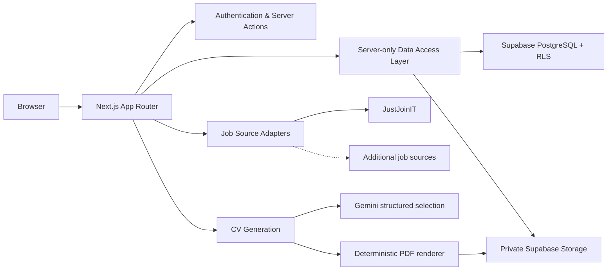

# Job Search

**Job Search** is a personal, production-oriented web application for managing and automating a high-volume job search workflow.

I started building it to solve a problem I was experiencing myself: job opportunities, application statuses, resumes, notes, and job-board searches were spread across different tools and required too much repetitive manual work.

The goal is to turn that workflow into one centralized and extensible system.

> **Status:** actively developed. Core job management, discovery, application tracking, private document storage, and CV generation flows are already implemented.

## What it does

* **Job tracking** — manage opportunities from discovery to offer or rejection with persistent status history.
* **Job discovery** — search external job sources, review full vacancy details, save relevant jobs, and hide irrelevant results.
* **Application board** — organize opportunities by their current hiring stage.
* **Search preferences** — maintain preferred titles and included/excluded technologies.
* **Duplicate prevention** — detect already saved or imported vacancies using stable external identities and normalized fallbacks.
* **CSV import** — migrate historical job-search data from Google Sheets exports.
* **Private Knowledge Base** — store resumes, candidate information, and supporting documents securely.
* **AI-assisted CV generation** — generate tailored CV versions for a specific vacancy using verified candidate data instead of unrestricted AI-generated facts.
* **CV history** — keep immutable generated CV versions for each job.
* **Dashboard** — track applications, interviews, rejections, offers, and historical activity.

## Why I built it

A serious job search can quickly become a data-management problem.

When applying across multiple job boards, it becomes difficult to answer simple questions reliably:

**Have I already seen this vacancy? Did I apply? Which CV did I use? Has this company rejected me before? Which opportunities are still active?**

Job Search provides one source of truth for that workflow and creates a foundation for progressively automating repetitive parts of the process.

The architecture is intentionally modular so that additional job sources and workflow integrations can be added without rebuilding the core application.

## Architecture



The application follows a **server-first architecture**. Personalized database access, authorization, private configuration, and storage operations remain on the server.

Client Components are used only where browser interaction is required.

External job boards are isolated behind a common adapter boundary, allowing additional sources to reuse the existing discovery, filtering, deduplication, selection, and persistence flows.

## AI-assisted CV generation

The CV generation flow is intentionally designed to reduce hallucinations.

Instead of asking an LLM to freely rewrite a resume, the application maintains a validated **Candidate Profile** as the source of truth.

Before the AI request, personal contact information is removed. Gemini receives structured career data and selects relevant existing facts and skills for the target vacancy.

The application then validates those selections against the original profile and generates the final PDF locally.

This means the model does not control contact details, arbitrary work history, HTML, CSS, or the final PDF layout.

Each generated CV is stored as an immutable version associated with the corresponding job.

## Job discovery

Job discovery uses a source-adapter architecture.

The first implemented source is **JustJoinIT**.

Search results are normalized into a shared internal representation before reaching the UI. The application then compares them against saved and ignored vacancies before presenting the final result set.

Full vacancy details are loaded only when needed.

Adding another job board requires implementing a new source adapter while the discovery table, detail drawer, filtering, selection, deduplication, and persistence logic remain shared.

## Security and privacy

Job Search stores potentially sensitive information such as resumes and application history, so authorization is enforced at multiple layers.

Authenticated resources are scoped to a verified user on the server and additionally protected by PostgreSQL Row Level Security.

Private documents and generated CVs are stored in non-public Supabase Storage buckets and are accessed through short-lived signed URLs.

The browser never directly queries private database tables or imports server-side Supabase repositories.

## Tech stack

**Frontend & application**
`Next.js 16` · `React 19` · `TypeScript` · `Tailwind CSS`

**Backend & data**
`Next.js Server Actions` · `Supabase Auth` · `PostgreSQL` · `Row Level Security` · `Supabase Storage`

**AI**
`Gemini API` · structured output · verified fact selection

**Testing & quality**
`Playwright` · Node.js test runner · database/RLS tests · ESLint · strict TypeScript

**Deployment target**
`Vercel` · `Supabase`

## Main routes

| Route             | Purpose                                       |
| ----------------- | --------------------------------------------- |
| `/dashboard`      | Job-search metrics and activity               |
| `/jobs`           | Searchable job database                       |
| `/jobs/discover`  | External job discovery                        |
| `/jobs/[id]`      | Job details, status history and generated CVs |
| `/board`          | Status-based application workflow             |
| `/filters`        | Search preferences                            |
| `/knowledge-base` | Private candidate documents                   |
| `/import`         | CSV migration and import                      |
| `/account`        | Account management                            |

## Running locally

Requirements:

`Node.js 24 LTS` · `npm 11` · `Supabase`

```bash
npm ci
cp .env.example .env.local
npm run dev
```

Configure the required Supabase environment values and Gemini API key in `.env.local`.

Apply the database migrations before using the production Supabase-backed data layer.

More detailed setup information is available in:

`docs/SETUP_AND_SECRETS.md`

## Validation

The project includes automated checks for application logic, browser workflows, database constraints, and authorization policies.

```bash
npm run lint
npm run typecheck
npm test
npm run test:e2e
npm run build
npm run db:test
```

The Playwright environment uses an isolated synthetic data adapter, allowing critical workflows to be exercised without production credentials or real user data.

## Project structure

```text
src/app                     routes, layouts and composition
src/features                domain-oriented application features
src/components/ui           shared UI primitives
src/lib/data                data-store contracts and adapters
src/lib/job-sources         external job-source adapters
src/lib/supabase            Supabase integration
supabase/migrations         database schema and policies
supabase/tests              database and RLS tests
tests/unit                  domain tests
tests/e2e                   browser workflows
```

## Current direction

The project is actively evolving from a job-tracking application into a broader **job-search automation platform**.

The architecture is designed to support additional job sources and workflow automation while keeping external integrations separated from the core job-management domain.

No production credentials or real job-search data are included in this repository.
